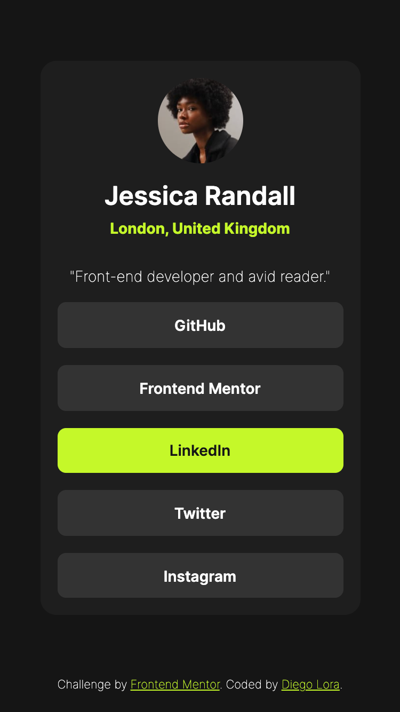

# Frontend Mentor - Social links profile solution

This is a solution to the [Social links profile challenge on Frontend Mentor](https://www.frontendmentor.io/challenges/social-links-profile-UG32l9m6dQ). Frontend Mentor challenges help you improve your coding skills by building realistic projects.

## Table of contents

- [Overview](#overview)
  - [The challenge](#the-challenge)
  - [Screenshot](#screenshot)
  - [Links](#links)
- [My process](#my-process)
  - [Built with](#built-with)
  - [What I learned](#what-i-learned)
  - [Continued development](#continued-development)
- [Author](#author)

## Overview

### The challenge

Users should be able to:

- See hover and focus states for all interactive elements on the page

### Screenshot



### Links

- Solution URL: [Add solution URL here](https://your-solution-url.com)
- Live Site URL: [Add live site URL here](https://your-live-site-url.com)

## My process

### Built with

- Semantic HTML5 markup
- CSS custom properties
- Flexbox
- Mobile-first workflow

### What I learned

I spot three cases of image manipulation on the avatar:

1. Using max-width and hardcode the size

```css
img {
  border-radius: 50%;
  max-width: 80px;
}
```

2. Because the avatar is square (176x176) I do not need to use aspect-ratio (1:1) along with object-fit: cover or contain.

```css
img {
  border-radius: 50%;
  aspect-ratio: 1/1;
  object-fit: cover;
}
```

3. There is an approach that uses width attribute inside the `` along with `max-width: 100%` and `height: auto`.

```html

```

```css
img {
  border-radius: 50%;
  max-width: 100%;
  height: auto;
}
```

### Continued development

In my case 1. do I need to add `width: 100%`?

Do I need to add option 2. only for cases when the image is not square? Should I put it on top of my option 1?

How important is option 3? I read that is to prevent Cummulative Layout Shift.

Too much overthinking, but I guess using the three would be fine. At least I could spot them and have some friction with the properties. I think image manipulation is getting more clear.

## Author

- Frontend Mentor - [@diegoloradigital](https://www.frontendmentor.io/profile/diegoloradigital)
- X - [@diego_lora\_](https://x.com/diego_lora_)
